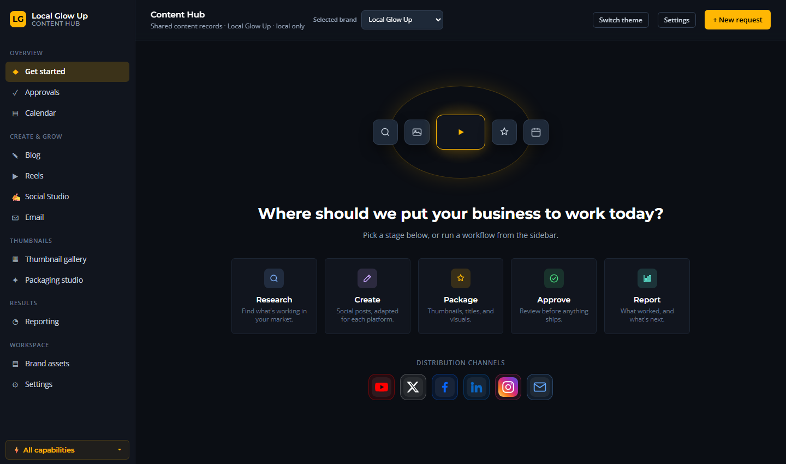
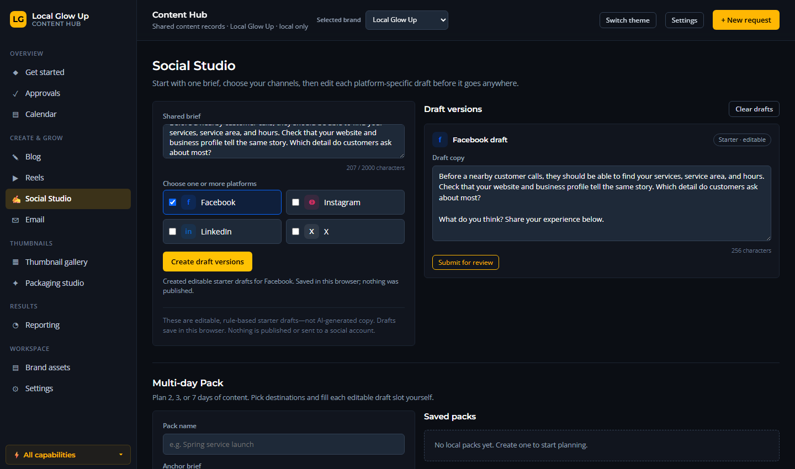

# Content Hub

A local, single-user workspace for running content end to end: draft posts,
emails, and articles; move them through a review-and-approve flow; keep brand
assets next to the content; and check read-only reporting sources. Everything
runs on your machine.

**Nothing publishes, sends, or schedules on its own — it is approval-first by design.**

## Screenshots

Captured in an isolated local workspace with an illustrative example draft. The draft was not published, and the images contain no private reporting data.

| Get Started | Social Studio |
| --- | --- |
|  |  |

## What it does

- **Content intake → approval → packaging → distribution** — one pipeline, no content dump.
- **Brand profiles** — voice, audience, offers, pillars, and positioning per brand.
- **Brand asset library** — reads each brand's files in place from `brands/<id>/assets/`.
- **Editors** — Blog, Reels, Email, plus a calendar, an approvals queue, and a repurpose view.
- **Read-only reporting** — Search Console, PageSpeed Insights, and newsletter stats — off by default; you connect what you want.
- **Approval gate** — only an *Approved* record offers a manual Markdown handoff. No CMS, social publisher, or email service is wired.

## Requirements

- Python 3.10+ (`requests` is the only third-party import)

## Run it

```bash
python server.py
```

Open **http://127.0.0.1:8000**. Keep the terminal open; press `Ctrl+C` to stop.

If port 8000 is busy: `python server.py --port 8001`.

> Do not use `python -m http.server` — that serves the page but not the asset API.

## Brand folders

The Hub reads brands from a brands root. By default that is `./brands` next to
this project. Point it elsewhere (for example a shared marketing system's brand
folder) with an environment variable:

```bash
CONTENT_HUB_BRANDS_ROOT="/path/to/brands" python server.py
```

Each brand is a folder:

```txt
brands/<brand-id>/
  brand-voice.md          tone and voice rules
  audience.md             who the brand serves
  offers.md               offers and calls to action
  content-pillars.md      recurring content themes
  positions/three-ps.md   the Person / Pain / Promise
  assets/                 logos, brand-guidelines, product-shots, studio-shots, social/
```

Three empty example brands ship with the repo: `brand-a`, `brand-b`, `brand-c`.
Rename them or add your own — update `BRANDS` in `server.py` if you change the ids.

### Assets

In **Brand assets**, choose the brand and a destination category, then **+ Add
asset**. Supported: PNG, JPG/JPEG, GIF, WebP, SVG, MP4, WebM, MOV, PDF (max 40 MB).
Existing filenames are never overwritten. Files placed directly in a brand folder
are picked up on refresh. Anything under `source-review/`, `_unused/`, or marked
`review-only` is labeled **NEEDS OWNER REVIEW** — that is not approval to publish.

## Data and privacy

- **Local-only.** The server binds to `127.0.0.1`; content lives in a local SQLite file under your user data directory.
- **No credentials in the repo.** Reporting keys and tokens live in environment variables or local files you control.
- **No publishing.** The only outbound calls are the read-only reporting sources you explicitly connect, and content is never sent anywhere.

## Tests

```bash
python -m pytest tests
```

## License

MIT — use it, fork it, adapt it.
